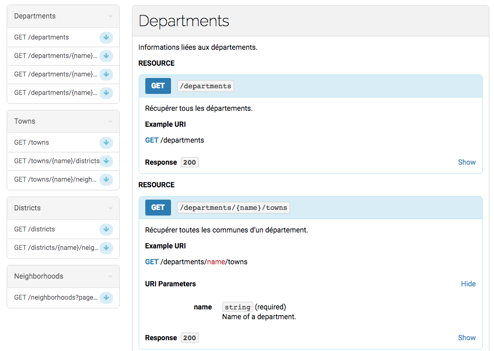

# bj-decoupage-territorial

[API](https://bj-decoupage-territorial.herokuapp.com/) (non officielle) pour obtenir des informations de base sur les départements, communes, arrondissements et les quartiers du Bénin. Elle s'inspire du fichier du découpage territorial du Bénin proposé par [leplutonien](https://github.com/leplutonien/decoupage_territorial_benin).

# Stack Technique
* [Node.js](https://nodejs.org/en/) ( [AdonisJS](https://adonisjs.com/) 😏 ) pour l'API
* [MySQL](https://www.mysql.com/) pour stocker les données
* [Aglio](https://github.com/danielgtaylor/aglio) & [API Blueprint](https://apiblueprint.org/) pour la doc de l'API
* [Heroku](https://www.heroku.com/) pour le déploiement continu.

# Tu as envie de donner un coup de pouce?
> Bah il y a beaucoup à faire 😁
* Ecrire les tests ( C'est con, mais c'est utile 😛 )
* Améliorer la doc 📚 
* Rajouter des nouvelles infos, donc écrire du code 🏄
* Mettre un petit star ⭐️ à ce dépôt.
* N'oublie pas de me suivre sur [Twitter](https://twitter.com/jgantindev) 👊!

# License
[MIT License](LICENSE.md)
